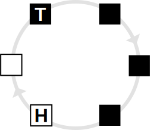
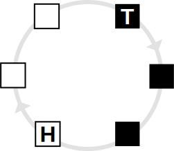

/*| provides |*/
message-queue

/*| requires |*/
task
timer
sched

/*| doc_header |*/

/*| doc_concepts |*/
## Message Queues

Message queues are a mechanism for transferring data between tasks.
They are concurrency safe, so they are guaranteed to always be in a consistent state when multiple tasks access them.
Applications can use them without the regard for synchronization or mutual exclusion that is otherwise necessary when accessing shared data structures.
The RTOS implementation of message queues provides this synchronization internally.

Message queues behave like first-in/first-out circular buffers.
Therefore, applications cannot access arbitrary messages in a queue.
Instead, the messages in a message queue are always ordered by age.

When an application puts a message in a message queue, the message is placed at the *head* of the queue.
This head of the queue is essentially the least recently used free message slot in the queue.
When retrieving a message from a queue, it is taken from the *tail* of the queue.
That is always the oldest, least recently added message in the queue.

A message queue with six slots and three messages, for example, is illustrated below:

After putting a message in the queue, it looks as follows:

And after the application has retrieved a message from the queue, it looks like this:

The behavior of a message queue also depends on whether it is empty or full, i.e., when zero or all slots contain messages.
Putting a message into a full queue (or retrieving a message from an empty queue) blocks the calling task until a free slot (or a message) is available.
The [Message Queue API] additionally provides non-blocking functions and time-out based functions.

Every message queue has a fixed number of message slots that all have the same fixed message size.
The number and size of slots are statically configured properties and cannot be changed at run time.

A message queue allocates the memory for all of its slots statically at build time.
Therefore, regardless of how many messages have been put into a queue at any given time, the queue always occupies the amount of memory necessary to hold its maximum capacity.
The put and get APIs copy the message contents to and from the slots, so message queues are better suited for shorter rather than for longer messages in terms of performance.

/*| doc_api |*/
## Message Queue API

### MessageQueueId

An instance of this type refers to a specific message queue.
The underlying type is an unsigned integer of a size large enough to represent all message queues[^MessageQueueId_width].
The [MessageQueueId] should be treated as an opaque value.
For all message queues in the system, the configuration tool creates a constant with the name `MESSAGE_QUEUE_ID_<name>` that should be used in preference to raw values.

[^MessageQueueId_width]: This is normally a `uint8_t`.

### `MESSAGE_QUEUE_ID_<name>`

These constants of type [MessageQueueId] exist for each message queue defined in the system configuration (see [Message Queue Configuration]).
Note that `<name>` is the upper-case conversion of the message queue's name.

### message_queue_put

void message_queue_put(MessageQueueId message_queue, const void *message);

This function waits - if necessary - until the given message queue is not full and then adds a message to the queue.

- The `message_queue` ID is typically one of the [`MESSAGE_QUEUE_ID_<name>`] constants as it must refer to a valid message queue as defined in the system configuration.

- The `message` pointer must point to a valid memory region large enough to hold a message of the size with which the message queue is configured.

If the queue is full, the function blocks the calling task until another task removes a message from the queue.
When the queue is not full, the function copies the message contents pointed to by `message` to the head of the queue, which is the free slot that was least recently used.

### message_queue_try_put

bool message_queue_try_put(MessageQueueId message_queue, const void *message);

This function adds a message to a message queue only if it is not full.

- The `message_queue` ID is typically one of the [`MESSAGE_QUEUE_ID_<name>`] constants, as it must refer to a valid message queue as defined in the system configuration.

- The `message` pointer must point to a valid memory region large enough to hold a message of the size with which the message queue is configured.

If the queue is full, the function returns false immediately without blocking the calling task.
If the queue is not full, the function copies the message contents pointed to by `message` to the head of the queue, which is the free slot that was least recently used.
In this case, the function returns true.

### message_queue_put_timeout

bool message_queue_put_timeout(MessageQueueId message_queue, const void *message, TicksRelative timeout);

This function adds a message to a message queue, but in contrast to [message_queue_try_put], it waits only for a limited amount of time for a message slot to become available if the queue is full.

- The `message_queue` ID is typically one of the [`MESSAGE_QUEUE_ID_<name>`] constants as it must refer to a valid message queue as defined in the system configuration.

- The `message` pointer must point to a valid memory region large enough to hold a message of the size that the message queue is configured with.

- The `timeout` value expresses the maximum wait time in ticks;
see [Time and Timers] for more details on timing considerations.
The result of calling this function with a `timeout` value of 0 is undefined.

If the queue is full, the function blocks the calling task until either another task removes a message from the queue or `timeout` ticks elapse, whichever comes first.
When the queue is not full, the function copies the message contents pointed to by `message` to the head of the queue, which is the free slot that was least recently used.
The function returns true if it successfully put the message into the queue;
otherwise, it returns false.

Note the following corner case when the queue is full.
As described above, the calling task blocks and a time-out occurs if no message slots become available in the meantime.
However, due to scheduling, the calling task may not become the current task again immediately after the time-out.
Instead, other tasks may be scheduled between the time-out occurring and the calling task becoming active.
Those other tasks may retrieve messages from the same message queue, making message slots available.
By the time the calling task becomes active, it successfully puts the message into the queue and returns true.
As a consequence, the return value does not indicate whether or not a time-out occurred, but whether or not the message was successfully put into the queue.

### message_queue_get

void message_queue_get(MessageQueueId message_queue, void *message);

This function waits - if necessary - until the given message queue contains a message, and then retrieves that message.

- The `message_queue` ID is typically one of the [`MESSAGE_QUEUE_ID_<name>`] constants as it must refer to a valid message queue as defined in the system configuration.

- The `message` pointer must point to a valid memory region large enough to hold a message of the size that the message queue is configured with.

If the queue is empty, the function blocks the calling task until another task puts a message into the queue.
When the queue is not empty, the function copies the contents of the message at the tail of the queue, which is the message least recently put into the queue, to the memory location pointed to by `message`.
The function also removes the message from the queue and advances the queue tail so that the message cannot be retrieved a second time.

### message_queue_try_get

bool message_queue_try_get(MessageQueueId message_queue, void *message);

This function retrieves a message - if one is available - from a message queue.

- The `message_queue` ID is typically one of the [`MESSAGE_QUEUE_ID_<name>`] constants as it must refer to a valid message queue as defined in the system configuration.

- The `message` pointer must point to a valid memory region large enough to hold a message of the size that the message queue is configured with.

If the queue is empty, the function returns false immediately without blocking the calling task, without causing a task switch, and without modifying the state of the message queue.
If the queue is not empty, the function copies the contents of the message at the tail of the queue, which is the message least recently put into the queue, to the memory location pointed to by `message`.
The function also removes the message from the queue and advances the queue tail so that the message cannot be retrieved a second time.
In this case, the function returns true.

### message_queue_get_timeout

bool message_queue_get_timeout(MessageQueueId message_queue, void *message, TicksRelative timeout);

This function retrieves a message from a message queue, but in contrast to [message_queue_get], it waits only for a limited amount of time for a message to become available if the queue is empty.

- The `message_queue` ID is typically one of the [`MESSAGE_QUEUE_ID_<name>`] constants as it must refer to a valid message queue as defined in the system configuration.

- The `message` pointer must point to a valid memory region large enough to hold a message of the size that the message queue is configured with.

- The `timeout` value expresses the maximum wait time in ticks;
see [Time and Timers] for more details on timing considerations.
The result of calling this function with a `timeout` value of 0 is undefined.

If the queue is empty, the function blocks the calling task until either another task puts a message into the queue or `timeout` ticks elapse, whichever comes first.
When the queue is not empty, the function copies the contents of the message at the tail of the queue, which is the message least recently put into the queue, to the memory location pointed to by `message`.
The function also removes the message from the queue and advances the queue tail so that the message cannot be retrieved a second time.
The function returns true if it successfully retrieved a message from the queue;
otherwise, it returns false.

Note the following corner case when the queue is empty.
As described above, the calling task blocks and a time-out occurs if no messages become available in the meantime.
However, due to scheduling, the calling task may not become the current task again immediately after the time-out.
Instead, other tasks may be scheduled between the time-out occurring and the calling task becoming active.
Those other tasks may put messages into the same message queue, making them available for retrieval.
By the time the calling task becomes active, it successfully retrieves a message from the queue and returns true.
As a consequence, the return value does not indicate whether or not a time-out occurred but whether or not a message was successfully retrieved from the queue.

/*| doc_configuration |*/
## Message Queue Configuration

### `message_queues`

The `message_queues` configuration item is a list of message queue configuration objects.

### `message_queues/message_queue/name`

This configuration item specifies the message queue's name.
Each message queue must have a unique name.
The name must be of an identifier type.
This is a mandatory configuration item with no default.

### `message_queues/message_queue/message_size`

This configuration item specifies the size in bytes of each message in the queue.
This is an optional configuration item with no default.
Either `message_size` or `message_type` needs to be specified for a message queue.

### `message_queues/message_queue/message_type`

This configuration item specifies the C type of each message in the queue from which the size of the messages is derived.
This is an optional configuration item with no default.
Either `message_size` or `message_type` needs to be specified for a message queue.

### `message_queues/message_queue/queue_length`

This configuration item specifies the maximum number of messages that the message queue can contain.
This is a mandatory configuration item with no default.

### Example

<pre>&lt;message_queues>
    &lt;message_queue>
        &lt;name>audio_samples&lt;/name>
        &lt;message_size>4&lt;/message_size>
        &lt;queue_length>32&lt;/queue_length>
    &lt;/message_queue>
&lt;/message_queues></pre>

/*| doc_footer |*/
