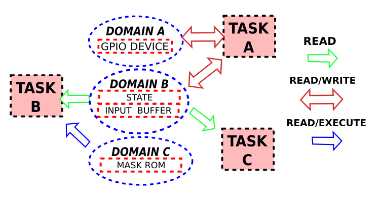
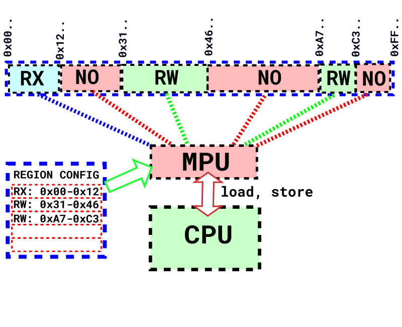
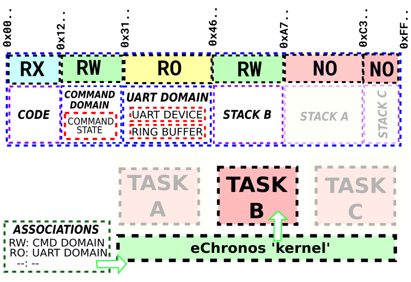

/*| provides |*/
mpu-armv7m

/*| requires |*/
rtos
task

/*| doc_header |*/
/*| doc_concepts |*/
## Memory Protection

The RTOS supports hardware memory protection by using the on-chip Memory Protection Unit (MPU).
Using memory protection can protect systems from many different types of errors, from simple programming mistakes to hardware failures.
The RTOS's implementation of memory protection provides:

- *Memory Isolation*: tasks may only access memory they are explicitly granted permission to use.

- *Privileged/User modes*: only the RTOS kernel should perform some critical operations and thus runs in privileged mode.

- *Determinism*: any violation of protection policies results in a predictable execution path after the violation.

### Protection Model

If memory protection is enabled, and no extra configuration information is supplied:

- Tasks may *only* read/write to their stack.

- All tasks are, in addition, granted *read-only access to the code segment*.
Note that this means tasks are not prevented from running code that does not belong to them[^mpu_code_segment].

- Tasks *may still make RTOS 'system calls'*, which now result in a switch to privileged mode, execution of the call, and a return to the next schedulable task in usermode.

- Any *protection faults cause the `fatal_error` handler to be called* with the protection fault error code.

[^mpu_code_segment]: Protecting the data and not the code is standard memory protection practice with such limited devices - it is a functionality tradeoff.

### Protection Domains, Data & Tasks

A key concept related to memory protection is how tasks are granted permission to access memory regions.
The RTOS implements 'Protection Domains' as a way of bookkeeping for memory regions.
A *protection domain* can contain one or more pieces of data (this is known as a 'symbol' domain) or encompass an address range, like a peripheral (this is known as an 'address' domain).
Tasks can be given different permissions to these domains, depending on what they require.
This facilitates decoupling of logical functionality and memory. For example:

In the above diagram, Domain A is an 'address' domain that encompasses a GPIO peripheral, Domain B is a 'symbol' domain that contains some data, and Domain C is another 'address' domain encompassing an address range for an on-chip ROM.
Task A is the only task that may write to Domain B, and thus can dictate how the 'STATE' data appears to Task B and Task C, with a guarantee that the data remains unmodified by Task B or Task C.
Task B is the only task that has access to Domain C, and so access to any memory in Domain C by Task A or Task C results in a protection fault.

Note that if a task has no domain associations at all, it is restricted to accessing its own stack and making RTOS calls.

When creating a system, the RTOS configuration mechanism is used to create and assign protection domains (See [Memory Protection Configuration] for more information).

### The ARMv7m Memory Protection Unit

Note that some devices in the ARMv7m family do not have an MPU.
Be sure to check the vendor documentation before using this feature.
Most ARMv7m MPUs have the same set of capabilities:

- *8 protection regions* (16 on some Cortex-M7 processors, but this is rare)
- Each region has *Readable / Writeable / Executeable flags*
- Each region has a *base address and region size*

A 'protection region' is essentially a partition of the processor's address space that enforces an access restriction.
Had we set up some basic protection regions, the address space might look like:

It is obvious that since the number of protection regions is limited, this must place some limitation on the RTOS.
The RTOS always needs at least 2 protection regions active during task execution to describe the following:

- The task stack
- The system code section

This leaves `8 - 2 = 6` regions for general-purpose use.
In practice, this means that tasks may only have a maximum of *6* associated domains on this architecture.
That is, any single task may only be granted access permissions to a maximum of 6 protection domains.

Active protection regions are changed at runtime depending on which task is currently scheduled, and which protection domains the task has access to. For example:

With task B currently running, the active protection regions are those corresponding to the system code segment, the stack of task b, the 'command domain' and the 'uart domain'. In the event that a new task is scheduled, the active protection regions are changed to suit the new task in accordance with the RTOS configuration.

### Adding Memory Protection to an Existing System

To begin converting an ordinary Acamar system into a protected system one must first:

- Enable the memory protection configuration option (`mpu_enabled`), and debugging information (`mpu_verbose_faults`)
- Change the build script (in the system configuration) to an MPU build script (i.e replace the `<machine>.build` module with `<machine>.build_mpu` or similar)

At this point, memory protection is enabled but the system is not very useful as tasks don't have any permissions.
To assign permissions to tasks, one must first create some protection domains.

General guidelines are provided below:

- Memory-mapped peripherals make great protection domains - any task that requires use of that peripheral can later be given read or write access to the domain.
- State that is shared between multiple tasks, and is logically related, makes a good candidate for a protection domain.
- ROM images that sit outside the processor's code region (by necessity) have to exist in a protection domain.

Keep in mind that choosing appropriate protection domains can often be quite application-specific.
Additionally, refactoring the system codebase may be necessary in order for protection domains to be assignable.
For example, if one task accesses more than 6 different memory regions (the upper limit on protection domains that can be associated with a single task), the functionality encompassed by that task may have to be split up.
When possible, global state that is used only by a single task should be moved to that task's stack - removing the need for a domain altogether.

In some cases (especially when using large third party drivers), it becomes difficult to figure out exactly what memory regions should be in a protection domain.
On ARM systems, GDB and the RTOS's debugging output is your friend.
By setting a breakpoint on the RTOS `fatal` handler, one can use GDB's `where` command for a backtrace.
If `fatal` was caused by a protection fault, the backtrace usually displays exactly which function or variable triggered the fault, as well as its address.
In cases when the backtrace does not display the faulting address (sometimes ROM calls can cause this), one can simply read it from the semihosting output that the RTOS emits.
In any event, this procedure can be used to create an appropriate protection domain for deep API calls.
Note that with this technique one must be careful to ensure that all meaningful control flow paths are traversed.

Once appropriate protection domains exist, the next step is to assign them to tasks.
That being said, often it is useful to create a domain, assign it to a task, quickly test to ensure the previous protection fault is no longer there, and repeat.
Generally, if creation of appropriate protection domains requires a lot of refactoring, it is easier to create most of the protection domains before associating them with tasks.

/*| doc_api |*/
/*| doc_configuration |*/
## Memory Protection Configuration

### `mpu_enabled`

This configuration item is a boolean with a default of false.
When true, memory protection capabilities of the RTOS are enabled.
The protection policies enforced depend on the rest of the memory protection configuration items.
If no other configuration options are set, every task only has access to its own stack.
Memory protected systems must be compiled with a special set of flags, so ensure that that the correct build scripts are used by the system to avoid strange error messages when memory protection is enabled.

### `mpu_verbose_faults`

This configuration item is a boolean with a default of false.
When true, instead of a protection fault directly resulting in calling the RTOS `fatal_error` function, the RTOS first emits debugging text indicating the fault address and status.
The text is emitted using the RTOS's default `debug_print` functionality.

### `mpu_skip_faulting_instructions`

This configuration item is a boolean with a default of false.
When true, instead of a protection fault calling the RTOS `fatal_error` function, any instructions that cause a protection fault are skipped.
It is intended for use in demo modules and for debugging.
This functionality is not recommended for use in 'real' systems, because it can easily cause unintended infinite loops and other undesired behaviour.

### `mpu_protection_domains`

This configuration item is a list of `protection_domain` configuration objects.
A protection domain denotes a named area of memory that can be associated with tasks.
Tasks define the permissions they have to protection domains in their task configuration.

### `mpu_protection_domains/protection_domain/name`

This configuration item specifies the protection domain's name.
Each domain must have a unique name, and be of an identifier type.
This is a mandatory configuration item with no default.

### `mpu_protection_domains/protection_domain/symbols`

This configuration item is a list of `symbol` configuration objects.
A protection domain with this field is known as a 'symbol' domain.
It collects C symbols from the project into a named area of memory.
Either `symbols` or `base_address` needs to be specified for a protection domain.

### `mpu_protection_domains/protection_domain/symbols/symbol`

This configuration item denotes either a C identifier, or an object file that corresponds to a source file after the build process.
For example, with an implementation file, `foobar.c`, that contains the following:

    int foo_int;
    int bar_int;

To include all global data elements from the file, we could indicate `foobar.o` as our symbol.
To instead include only `bar_int`, we could indicate `bar_int` as our symbol.

### `mpu_protection_domains/protection_domain/base_address`

This configuration item denotes the start of a memory address range.
A protection domain with this field is known as an 'address' domain.
It creates a named area of memory from the supplied `base_address` up to `base_address+domain_size`.
This is commonly used (for example) when giving tasks access to hardware peripherals.
Either `symbols` or `base_address` needs to be specified for a protection domain.

### `mpu_protection_domains/protection_domain/domain_size`

This configuration item denotes the size of the protection domain in bytes.
For a 'symbol' domain, this indicates how much memory the protection domain uses, irrespective of whether it is full of symbols or not.
If the symbols provided do not fit into the indicated `domain_size`, the system fails to build and emits an error.
For an 'address' domain, this indicates the size of the address range corresponding to the domain.
This is a mandatory configuration item with no default.

### `tasks/task/mpu_associated_domains`

This configuration item is a list of `domain` configuration objects.
Each `domain` entry defines permissions that tasks have to a specific protection domain.
A task does not have read or write access to any protection domains unless it is associated with them.
This is an optional configuration item, with a default of no associated domains.

### `tasks/task/mpu_associated_domains/domain/name`

This configuration item specifies the protection domain that this entry associates the task with.
This property must have the same value as the corresponding `mpu_protection_domains/protection_domain/name`.
This is a mandatory configuration item with no default.
A domain association with no properties except the domain name results in read-only access being granted.

### `tasks/task/mpu_associated_domains/domain/readable`

This configuration item is a boolean with a default of true.
When true, the task may read from the indicated protection domain without causing a protection fault.

### `tasks/task/mpu_associated_domains/domain/writeable`

This configuration item is a boolean with a default of false.
When true, the task may write to the indicated protection domain without causing a protection fault.
Note that on most architectures, writeable permissions without readable permissions are not valid.

### `tasks/task/mpu_associated_domains/domain/executable`

This configuration item is a boolean with a default of false.
When true, the task may execute code in the indicated protection domain without causing a protection fault.
This is commonly used when (for example) the processor requires execution from a ROM to perform certain functions.
Note that on most architectures, executable permissions without readable permissions are not valid.

/*| doc_footer |*/
