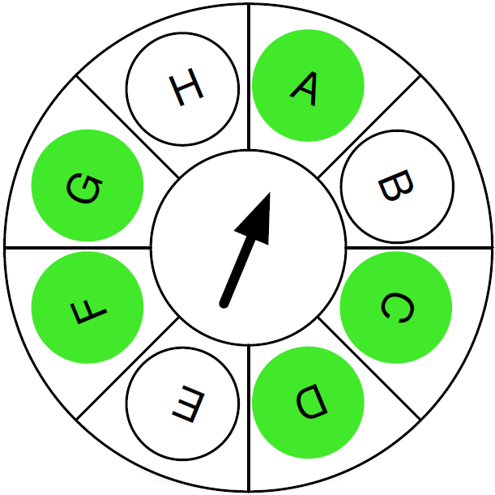
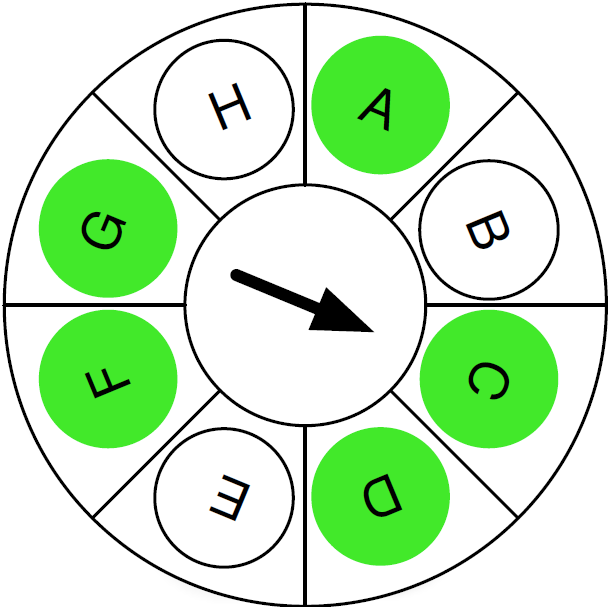
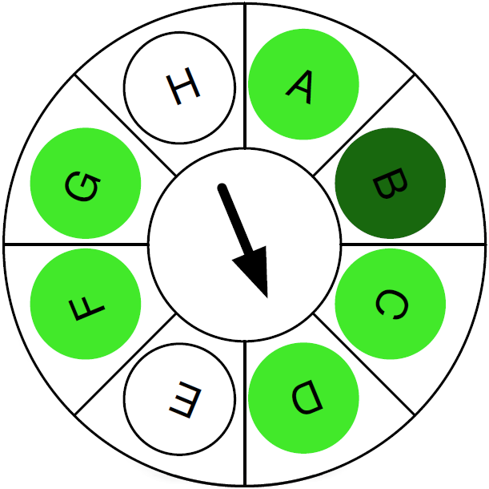
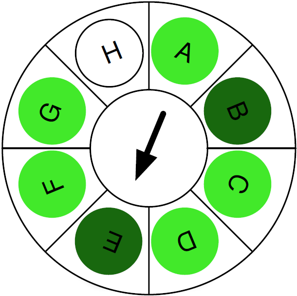

/*| provides |*/
sched-rr
sched

/*| requires |*/
task

/*| doc_header |*/

/*| doc_concepts |*/
## Scheduling Algorithm

The scheduling algorithm is an important component of the RTOS because it determines which one of the runnable tasks is selected for active execution.
For this purpose, the RTOS uses a round-robin algorithm without priorities.
The remainder of this section explains this algorithm in more detail.

The tasks in the system can be imagined as forming points on a clockface, with the clock hand pointing to the current task.
When a task blocks (or yields), the algorithm determines the next task by moving the hand forward until a runnable task is found.
In the diagram below, A is the current task and has just called the [yield] API, keeping A in the runnable state but requiring the scheduler to make a scheduling decision.
The algorithm firstly considers B, which is not runnable, and then considers C, which is runnable, so C is chosen.

The next diagram shows the state of the algorithm after choosing C.

While C is executing, task B may exit the blocked state and become runnable (e.g., via an interrupt).
If C now calls the [yield] API, the scheduling algorithm continues and chooses the next runnable task D.

As D was runnable before B became runnable, this behavior is what would be expected in most cases (and is the same as would happen in a FIFO algorithm).

The exact behavior of the scheduler becomes slightly more interesting, and possibly somewhat unexpected, if task E should now become runnable while D is executing.

If D now calls the [yield] API after E becomes runnable, then the scheduling algorithm picks E as the next current task.
In this case, E is chosen before the task B is chosen, even though it became runnable after B.
Not only is E selected before B, it is also selected before both F and G, which were already runnable.
This is different to how a FIFO based scheduling algorithm would operate.

For every revolution of the clock hand, each task has an opportunity to be selected.
This algorithm has the property that task execution always occurs in a predictable order.
For example, if A, B, and C are all runnable then the order of execution is always [A,B,C], and never, [B,A,C] or some other permutation.

The scheduling algorithm considers tasks in the same order in which they are defined in the system configuration (see [Task Configuration]).

/*| doc_api |*/

/*| doc_configuration |*/

/*| doc_footer |*/
