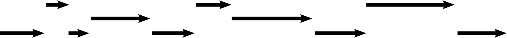
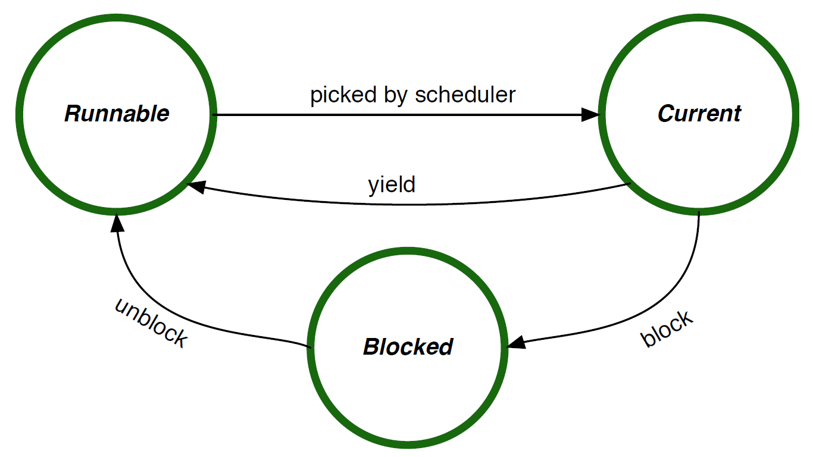

/*| provides |*/
task

/*| requires |*/
rtos
error

/*| doc_header |*/

/*| doc_concepts |*/
## Tasks

As the core mechanism of the RTOS, tasks are the basic building blocks for structuring complex systems.
Tasks provide independent control flows that can, on the one hand, be easily understood, implemented, and maintained.
On the other hand, they interact with each other via the RTOS APIs to form a complete application and provide its full functionality.

### Task and System Structure

In general, a CPU executes a stream of instructions that modify internal state (registers and memory) and control external devices.
The challenge for an application developer is to work out which instructions should be executed to obtain the desired application behavior.

For systems with simple requirements this can be easily achieved with a single big-loop design.
However as the inherent complexity of requirements increases, a single big-loop becomes too complicated to effectively develop, reason about, or debug.

The diagram below shows an example of this big-loop design.
As more demands are placed on the system, the code in the *logic* part of the code becomes too complicated.

<table width="100%"><tr width="100%">
<td class="codebox" width="100%"><pre>void main(void)
{
    for (;;) {
        /*... logic A ...*/

        /*... logic B ...*/

        /*... logic C ...*/
    }
}</pre></td></tr></table>

There are multiple ways that a system designer could start to address this complexity.
The overarching design principle is separation of concerns, where logic that addresses different aspects of the system are separated in some manner to make the complexity more manageable.
One approach to decomposing a system is to structure the functionality so that rather than a single large loop, there are multiple smaller loops, each performing a cohesive set of actions.

The RTOS implements this abstraction by providing tasks.
Each task in the system executes its own loop, and the RTOS provides the underlying mechanism for switching the CPU from one task to another.

The diagram below shows three tasks, A, B and C, each with their own loop.
The logic for each of these should be simpler than the case where this logic is mixed in a single big loop.
The arrows show how each task executes independently on the underlying CPU.
The end of each arrow represents the point in time where the RTOS switches the CPU from running one task to running a different task.

<table width="100%"><tr width="100%">
<td width="33%" class="codebox"><pre>void task_a(void)
{
    for (;;) {
        /*... logic A ...*/
    }
}</pre></td>
<td width="33%" class="codebox"><pre>void task_b(void)
{
    for (;;) {
        /*... logic B ...*/
    }
}</pre></td>
<td width="33%" class="codebox"><pre>void task_c(void)
{
    for (;;) {
        /*... logic C ...*/
    }
}</pre></td>
</tr></table>

### Task Names

Each task in the system has a unique name chosen and configured by the system designer.
The name is an ASCII string[^task_names] and should describe the functionality of the task (also see the [`tasks/task/name`] configuration item).

Within the RTOS and the application implementation, task names translate to constants of type [TaskId].
Each task has a unique [TaskId] which is assigned automatically by the RTOS configuration tool.
The RTOS configuration tool generates a symbolic macro of the form [`TASK_ID_<name>`].
Application code should use this symbolic macro rather than directly using integer values to refer to tasks.

[^task_names]: There are some additional restrictions on valid names.
See the [Configuration Reference] section for more details.

### Task Functions

Each task in the system is configured with a function that serves as the entry point into the implementation of the given task's functionality.
The RTOS sets up each task such that when it is started, it begins its execution with this function.
Task functions are configured statically together with the other task properties (also see [`tasks/task/function`]).

For the RTOS to correctly call a task's function, it must have the type signature `void fn(void)`.
That is, it shall have no arguments because the RTOS does not supply any arguments to task functions.
Furthermore, it is an implementation error for a task function to return.
The effect of a task function returning is generally undefined, but it may result in a fatal error state (see [Error Handling]).

Although it is a less common system design, multiple tasks may share the same task function because they run on separate stacks.
However, such a setup requires particular care with regard to concurrent access to shared data structures and resources.

### Task Stacks

Each task in the system has its own unique stack.
Stacks are created and set up by the RTOS configuration and runtime environment, so a system designer's main concern with stacks is choosing an appropriate size.

Stacks are used for several purposes while an application runs:

- The primary user of a stack is the task code itself as it holds variables and return addresses during function calls.

- Additionally, when the RTOS performs a task switch away from a task, it saves that task's context (such as its register values) on its stack.

- Furthermore, [Interrupt Service Routines] use the stack of the task they interrupt.

The size of each stack is chosen by the system designer and configured statically and individually for each task (see the [`tasks/task/stack_size`] configuration item in the [Task Configuration] Section).
This size needs to be chosen carefully to ensure that there is sufficient space on the stack for all the kinds of stack usage listed above.

The effect of a stack overflow, when a task, the RTOS, or one or more ISRs require more than the available stack space, is generally undefined.
On some target platforms, the RTOS may support available hardware or software mechanisms to detect stack overflows.

### Task Switching

The task that is actively executing on the CPU is known as the current task (also see the [task_current] API).
To multiplex multiple tasks on a single CPU, the RTOS implements a context switching mechanism for changing the current task.
The task's context refers to all the state associated with the task but for which the underlying hardware can support only one copy at a time.
Specifically, the processor only supports a single program counter, stack pointer, and register state.
During a context switch, the RTOS saves the current task's state on the task's stack and then restores the state for the new current task.

The [Preemption] section provides more details on context switches, what can lead to them, and how to control them, which is an important aspect of constructing correct system behavior.

### Task States

An RTOS task can be in one of three primary states: current, runnable, or blocked.
Tasks within a system do no usually operate in isolation;
they interact with other tasks, devices, and the external environment.
When interacting with another entity, the RTOS provides mechanisms so that the task can wait until the other entity is ready, rather than the task needing to constantly poll the other entity.
When a task is waiting, it moves into the blocked state.
There are a number of RTOS operations that cause a task to block, such as waiting for a signal, locking a mutex, or sleeping.
When a task is in the blocked state, it is no longer current, so the RTOS must choose another runnable task to become the current task.
The blocked task unblocks and becomes runnable when the entity it is waiting on is ready, e.g., when a signal is delivered, a mutex is available, or a sleep duration has completed.

It is possible for the overall system to arrive in a state where all tasks are in the blocked state[^blocked_state].
In this situation, there is no current task and the system enters an idle mode.
When the system is in idle mode, interrupts may still occur and interrupt handlers are still processed.
Tasks may become runnable again when an interrupt handler unblocks a task via an interrupt event (see [Interrupt Events]).
If the platform supports it, the RTOS places the hardware into a low-power state while the system is idle.

[^blocked_state]: In a system designed to operate with low power consumption, it is desirable for this to be the case most of the time.

When there is more than one task in the runnable state, the RTOS must use the scheduling algorithm to determine the task that becomes current.
The scheduling algorithm is described in the [Scheduling Algorithm] section.

/*| doc_api |*/
## Task API

### TaskId

Instances of this type identify specific tasks.
The underlying type is an unsigned integer of a size large enough to represent all tasks[^task_id_type].
The [TaskId] should generally be treated as an opaque value.
Arithmetic operations should not be used on a [TaskId].

The application may assume that a [TaskId] is in the range [TASK_ID_ZERO] through [TASK_ID_MAX].
For example, if a per-task data structure is required, it is valid to use a fixed size array and index the array by using the [TaskId].
For iterating over such an array, it is valid use to increment an instance of [TaskId], however care must be taken to ensure the resulting value is in range.
[TaskId] instances can be tested for equality, however other logical operations (e.g., comparison) should not be used.
For all tasks in the system, the configuration tool creates a constant with the name `TASK_ID_<name>` that should be used in preference to raw values.

[^task_id_type]: This is normally a `uint8_t`.

### TASK_ID_ZERO

This constant has the type [TaskId] and represents the task with the numerically lowest task ID in the system.
This can be used in cases where application code wishes to iterate over all tasks in the system.

### TASK_ID_MAX

This constant has the type [TaskId] and represents the task with the numerically highest task ID in the system.
This can be used in cases where application code wishes to iterate over all tasks in the system.

### `TASK_ID_<name>`

These constants have the type [TaskId].
A constant is created for each task in the system, where `<name>` is the upper-case conversion of the task's name (see [Task Names]).

### task_current

TaskId task_current(void);

This function returns the task ID for the current task.

/*| doc_configuration |*/
## Task Configuration

### `tasks`

This configuration is a list of `task` configuration objects.
The configuration must include at least one task because a system without tasks cannot run application functionality.

### `tasks/task/name`

This configuration item specifies the task's name (also see [Task Names]).
Each task must have a unique name.
The name must be of an identifier type.
This is a mandatory configuration item with no default.

### `tasks/task/function`

This configuration item specifies the task's function (also see [Task Functions]).
It must be the name of a function that the application implements so that it is available at link time.
This is a mandatory configuration item with no default.

### `tasks/task/stack_size`

This configuration item specifies the task's stack size in bytes (also see [Task Stacks]).
It is a mandatory configuration item with no default.

[[#task_start_api]]
### `tasks/task/start`

This boolean configuration option determines whether a task should automatically start when the RTOS is started.
If the task is not automatically started, it can be started using the [task_start] API.
This is an optional configuration item that defaults to false.
At least one task in the system should be configured with `start` as true, otherwise no task and hence no application functionality can ever start running in the system.
[[/task_start_api]]

/*| doc_footer |*/
